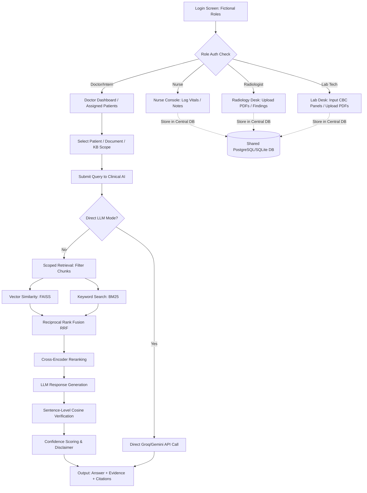

# RAG Based Clinical Decision System

This documentation provides a comprehensive guide to the architecture, pipeline, database structure, and user workflows of the RAG Based Clinical Decision System. It serves as an academic and professional project presentation guide.

---

## 1. PROJECT SUMMARY
The **RAG Based Clinical Decision System** is a professional clinical decision-support application designed for hospital environments. It allows multiple healthcare professionals—including doctors, nurses, radiologists, and laboratory technicians—to collaboratively manage patient care through a centralized repository. By integrating Retrieval-Augmented Generation (RAG) with strict sentence-level fact verification and confidence scoring, the system answers clinical queries, summarizes complex medical reports, and retrieves guidelines with grounded citations. The system is designed strictly as a decision-support aid and is not an autonomous diagnostic system. Responses are strictly anchored in trusted guidelines and patient history to ensure verification of evidence before clinical application.

---

## 2. PROBLEM STATEMENT
Hospital environments are saturated with vast quantities of unstructured clinical documents (e.g., lab summaries, radiology findings, nursing logs) and massive clinical reference guidelines. Clinicians face several critical challenges:
1. **Information Overload**: Finding specific diagnostic clues in hundreds of pages of textbooks or multi-page patient charts is time-consuming.
2. **Disconnected Workflows**: Vitals, laboratory logs, and radiology images are often isolated, preventing a holistic patient overview.
3. **AI Hallucinations**: Standard Large Language Models (LLMs) tend to make up (hallucinate) medical information, which is extremely high-risk in healthcare.
4. **Lack of Evidence**: Clinicians require clear citations and reference validation before applying any recommendation.

---

## 3. OBJECTIVES
- Build a unified hospital database containing patient metadata, vitals, logs, notes, and clinical document pathways.
- Implement a hybrid RAG pipeline (FAISS + BM25) with Reciprocal Rank Fusion (RRF) to retrieve both semantic context and exact medical terms.
- Establish strict sentence-level verification using cosine similarity of embeddings to flag unsupported or partially supported claims.
- Enable three distinct document scopes (General Knowledge, Patient Records, and Session PDFs) to ensure secure query containment.
- Provide a responsive role-based React dashboard for collaborative data input and AI-guided clinical consultation.

---

## 4. USERS AND ROLES
The system includes five fictional demo roles with tailored actions:
1. **Dr. Arun / Dr. Meera (Doctor)**: View assigned patients, add clinical notes, consult the Clinical AI with access restricted to assigned patients, upload guidelines, and review summaries.
2. **Priya (Nurse)**: Update vitals (blood pressure, temperature, heart rate, oxygen levels), write nursing shift logs, and upload nursing documents.
3. **Rahul (Radiologist)**: Upload radiological report PDFs (e.g., Chest X-Rays, MRIs) and record text summaries/findings.
4. **Ananya (Laboratory Technician)**: Input structured CBC results (hemoglobin, WBC count, CRP level) and upload lab report PDFs.
5. **Arjun (Intern)**: View assigned patient records and query the Clinical AI in a read-only manner.

---

## 5. COMPLETE SYSTEM FLOW

---

## 6. DATABASE STRUCTURE
The system operates on **one common hospital database** (SQLAlchemy-managed SQLite/PostgreSQL), mapping clinical observations directly to the patient object.

- **USERS**: Stores demographic data, username, and role.
- **PATIENTS**: Central record with age, gender, status, and assigned doctor mapping.
- **PATIENT_VITALS**: Time-stamped vitals (BP, pulse, temp, spo2) mapped to a patient and recorded by a nurse.
- **LAB_RESULTS**: Structured blood metrics (Hemoglobin, WBC, CRP) recorded by a lab tech.
- **RADIOLOGY_REPORTS**: Radiological findings text and associated document pathways recorded by a radiologist.
- **CLINICAL_NOTES**: Free-text clinical records written by doctors/interns.
- **DOCUMENTS**: Metadata tracking file path, scope (Knowledge Base / Patient / Temporary), document type, chunk count, and uploader user.
- **CHAT_SESSIONS & CHAT_MESSAGES**: Consultation history containing RAG responses, confidence level, evidence sources, and verification results.

---

## 7. PDF PROCESSING
When a clinical document is uploaded, it progresses through an ingestion pipeline:
1. **Text Extraction**: The `pypdf` library extracts text page-by-page.
2. **Chunking**: A character-based splitting algorithm slices text into overlapping 500-character segments (100-character overlap) to preserve local boundaries.
3. **Metadata Mapping**: Chunks are labeled with `document_id`, `scope`, `pdf_name`, `page_number`, and `patient_id` (if applicable).
4. **Embedding Generation**: The `all-MiniLM-L6-v2` transformer embeds chunks into 384-dimensional vectors.
5. **Indexing**: Vectors are indexed in FAISS and stored in a pickle metadata array.

---

## 8. RAG PIPELINE BREAKDOWN

| Component | What is it? | Why is it used? | Where is it used? |
| :--- | :--- | :--- | :--- |
| **Text Extraction** | Extracting raw text from PDF files. | Converts unstructured documents into queryable text strings. | Document Ingestion |
| **Chunking** | Splitting text into smaller paragraphs. | Ensures retrieval of localized facts and fits LLM context windows. | Document Ingestion |
| **Embeddings** | Dense mathematical vectors. | Captures semantic meanings of words and clinical sentences. | Query and Ingestion |
| **FAISS Index** | Indexing library for vector search. | Enables high-speed nearest-neighbor similarity searches. | Retrieval stage |
| **BM25 Retriever** | Pure Python keyword search. | Matches exact clinical terms, numerical values, and codes. | Retrieval stage |
| **RRF Fusion** | Reciprocal Rank Fusion. | Merges semantic (FAISS) and lexical (BM25) ranks robustly. | Retrieval stage |
| **Cross-Encoder** | Reranking transformer model. | Evaluates query-passage pairs deeply to improve relevance. | Retrieval stage |
| **LLM Generation** | Llama 3.3 (or Gemini Flash). | Synthesizes retrieved evidence into readable answers. | Answer Generation |
| **Sentence Verification** | Cosine similarity check. | Verifies every sentence of the answer against source chunks. | Fact-Verification stage |
| **Confidence Scoring** | Scoring algorithm. | Assigns a confidence score and level (High, Medium, Low) to answers. | Fact-Verification stage |
| **Citations** | Reference list. | Exposes source file names, page numbers, and supporting text. | Frontend UI |

---

## 9. TECHNOLOGY TABLE

| Technology | Where Used | Why Used |
| :--- | :--- | :--- |
| **Python 13** | Backend Engine | Standard programming language for machine learning and FastAPI. |
| **FastAPI** | REST API | Extremely fast, lightweight, and automatically documents endpoints with Swagger. |
| **PostgreSQL / SQLite** | Central Storage | Relational databases matching users, patients, and logs via SQLAlchemy. |
| **SQLAlchemy** | Database ORM | Object Relational Mapper providing abstraction over database tables. |
| **LangChain (Concept)** | RAG Patterns | Clean structure for chunking, prompting, and verification. |
| **pypdf** | PDF Reader | Fast and reliable library to extract text page-by-page from medical files. |
| **SentenceTransformers** | Embeddings / Reranking | Hosts `all-MiniLM-L6-v2` and `cross-encoder` models locally. |
| **FAISS** | Vector Search | Facebook AI Similarity Search for dense vector retrieval. |
| **React + TypeScript** | Frontend | Highly modular, type-safe framework for building responsive user dashboards. |
| **Tailwind CSS** | Styling | Modern utility-first CSS framework for clean, professional clinical themes. |

---

## 10. WHY HYBRID RETRIEVAL?
- **FAISS (Semantic)**: Finds passages with similar medical concepts, even if they use different terminology (e.g., mapping "high blood sugar" to "diabetes").
- **BM25 (Keyword)**: Finds exact terminology, abbreviations (e.g., "CBC", "CRP"), and numbers (e.g., "14,000 WBC", "10.2 hemoglobin").
- **Combination**: Hybrid retrieval ensures both conceptual understanding and precise keyword matching, which is critical for clinical decision safety.

---

## 11. WHY RERANKING?
FAISS and BM25 retrieve candidates independently. A bi-encoder embeds query and document separately, which is fast but misses contextual interactions. A **Cross-Encoder Reranker** processes the query and retrieved passage *together*, computing deep attention across both. Reranking ensures the most contextually relevant passages are positioned first for the LLM.

---

## 12. WHY RAG?
Standard LLMs hallucinate and lack access to private hospital records. Retrieval-Augmented Generation (RAG) retrieves relevant documents *first* and instructs the LLM to write answers using *only* that context.
*Note: RAG does not completely prevent hallucinations, but it grounds answers in verified evidence to reduce unsupported generation.*

---

## 13. STRICT RAG VS DIRECT LLM
- **STRICT RAG (Default)**: Leverages hybrid search, Cross-Encoder reranking, and fact verification. If the retrieved evidence is insufficient or generates unsupported claims, the system triggers a **Low-Confidence Fallback** ("I don't know").
- **DIRECT LLM**: Calls the LLM directly without retrieving context. Clearly labels responses as unsupported by clinical files for user safety.

---

## 14. PATIENT-SCOPED RAG
When a doctor asks about a patient's report (e.g., *"Summarize Rahul's blood report"*), general medical knowledge must not mix with patient facts. The backend applies a strict pre-retrieval metadata filter:
`patient_id = P001`
Only document chunks matching this filter are scored and sent to the LLM, preventing cross-patient leaks.

---

## 15. CITATIONS
Every generated sentence is annotated with source citations (PDF file name and page number). By clicking a sentence, the clinician can inspect the exact matching source passage, supporting clinical audit and transparency.

---

## 16. ROLE-BASED ACCESS CONTROL
To protect Patient Health Information (PHI), access is verified on the backend:
- Users must send an `X-User-Id` header identifying their account.
- Doctors and Interns are restricted: they can only view profiles and query AI for patients assigned to them.
- General users (Nurses, Radiologists, Lab Techs) can view all patients but can only perform actions assigned to their role.

---

## 17. DEMO SCENARIO
1. **Upload**: Radiologist Rahul logs in -> Selects Rahul (P001) -> Uploads `Chest_XRay_Report.pdf` -> Enters visual text findings.
2. **Log Vitals**: Nurse Priya logs in -> Selects Rahul (P001) -> Logs Blood Pressure (145/90) and pulse (98 bpm) -> Saves record.
3. **Consolidated View**: Dr. Arun logs in -> Selects Rahul (P001) under "My Patients" -> Reviews new vitals, radiology findings, and attached documents.
4. **Summary**: Dr. Arun clicks `Chest_XRay_Report.pdf` -> Clicks "Generate Summary" to view key findings.
5. **AI Q&A**: Dr. Arun consults Clinical AI under patient scope -> Asks: *"What are the abnormal chest findings?"* -> System answers using only Rahul's reports.
6. **Hybrid Query**: Dr. Arun switches scope to `Patient + Guideline` -> Asks: *"Based on this patient's report, what does the hospital guideline say about this finding?"* -> RAG retrieves both patient X-Ray details and general hospital guidelines, and clearly labels both evidence sources.

---

## 18. LIMITATIONS
- **Prototype Scope**: Designed for academic/presentation demonstration.
- **Synthetic Data**: Operates on simulated patient metadata and logs.
- **No OCR**: Relies on selectable text inside PDFs (scanned image PDFs require OCR preprocessing).
- **No Real Integration**: Isolated sandbox database not linked to real hospital EHR systems.

---

## 19. FUTURE SCOPE
- Integrate Tesseract OCR for scanned PDF reports.
- Support FHIR (Fast Healthcare Interoperability Resources) data standards.
- Add audit logging for tracking which clinician retrieved which document.
- Implement physician double-signature workflows for finalizing records.
